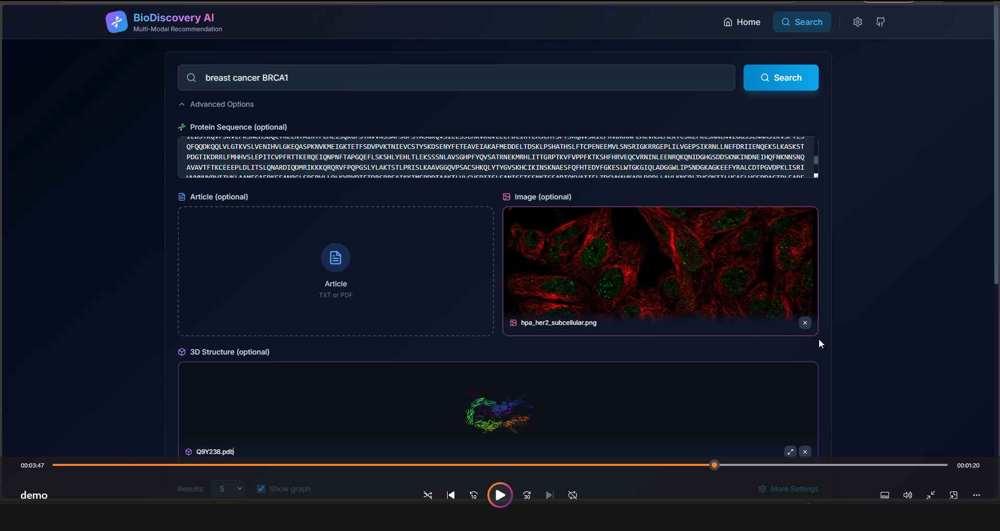

# 🧬 BioDiscovery AI - Complete Technical Documentation v3.3

## 📋 Table of Contents

1. [Overview](#overview)
2. [Tech Stack & Tools](#tech-stack--tools)
3. [Code Architecture (Folders)](#code-architecture-folders)
4. [Key Concept: Metadata → Queries](#key-concept-metadata--queries)
5. [The 3 Search CASES](#the-3-search-cases)
6. [LangGraph Nodes Architecture](#langgraph-nodes-architecture)
7. [Optional Nodes](#optional-nodes)
8. [Detailed Qdrant Integration](#detailed-qdrant-integration)
9. [Problems Solved](#problems-solved)
10. [Usage Examples](#usage-examples)
11. [Quick Start](#quick-start)

## 🎥 Demonstration
### 🖼 Interface Overview
[](https://vimeo.com/1162228913?share=copy&fl=sv&fe=ci)

### 🎬 Demo Video
[▶ Watch the demo video](https://vimeo.com/1162228913?share=copy&fl=sv&fe=ci)

## Overview

**BioDiscovery AI** is a multimodal search system for computational biology enabling simultaneous search across 5 collections:

| Collection | Content | Source | Vectors |
|------------|---------|--------|----------|
| 🧬 **proteins** | Sequences, functions | UniProt | text (768d) + sequence (1280d) + sparse |
| 📄 **articles** | Scientific literature | PubMed | text (768d) + sparse |
| 🖼️ **images** | Pathways, localizations | KEGG, HPA | caption (768d) + image (512d) + sparse |
| 🧪 **experiments** | Expression data | GEO | text (768d) + sparse |
| 🔬 **structures** | 3D structures | PDB, AlphaFold | text (768d) + structure (768d) + sparse |

---

## Tech Stack & Tools

### 🔧 Backend

| Tool | Version | Usage |
|------|---------|-------|
| **Python** | 3.11+ | Main language |
| **FastAPI** | 0.109+ | Async REST API |
| **LangGraph** | 0.0.50+ | Workflow orchestration (State Machine) |
| **Qdrant** | 1.7+ | Vector database |
| **Pydantic** | 2.0+ | Data validation |
| **Uvicorn** | 0.27+ | ASGI server |

### 🧠 Encoding Models

| Model | Dimension | Usage |
|-------|-----------|-------|
| **BGE-base-en-v1.5** | 768d | Text encoding (dense) |
| **ESM2-650M** | 1280d | Protein sequence encoding |
| **BiomedCLIP** | 512d | Biomedical image encoding |
| **SPLADE/BM25** | Sparse | Lexical encoding (exact terms) |

### 🤖 LLM (Bridge & Design Assistant)

| Model | Usage |
|-------|-------|
| **Gemini 1.5 Pro** | Bridge LLM (query generation) |
| **Gemini 1.5 Pro** | Design Assistant (candidates) |
| **Gemini 1.5 Pro** | Summary generation |

### 🎨 Frontend

| Tool | Usage |
|------|-------|
| **React** | UI Framework |
| **TypeScript** | Static typing |
| **Tailwind CSS** | Styling |
| **Zustand** | State management |
| **React Query** | Data fetching |
| **Mol* Viewer** | 3D structure visualization |

### 🗄️ Database

| Tool | Usage |
|------|-------|
| **Qdrant** | Vector storage (dense + sparse) |
| **Redis** | Embedding cache (optional) |

### 📦 Data Pipeline

| Tool | Usage |
|------|-------|
| **requests** | API calls (UniProt, PubMed, etc.) |
| **BioPython** | FASTA, PDB parsing |
| **pandas** | Data processing |
| **tqdm** | Progress bars |

---

## Code Architecture (Folders)

```
biodiscovery-ai/
│
├── 📁 backend/
│   ├── 📁 app/
│   │   ├── 📁 api/
│   │   │   ├── __init__.py
│   │   │   ├── routes.py              # FastAPI endpoints
│   │   │   └── dependencies.py        # Dependencies (auth, etc.)
│   │   │
│   │   ├── 📁 core/
│   │   │   ├── __init__.py
│   │   │   ├── config.py              # Configuration (env vars)
│   │   │   ├── encoders.py            # BGE, ESM2, BiomedCLIP, Sparse
│   │   │   ├── qdrant_client.py       # Qdrant client (search, upsert)
│   │   │   ├── llm_client.py          # Gemini client (Bridge, Summary)
│   │   │   └── cache.py               # Redis embedding cache
│   │   │
│   │   ├── 📁 graph/
│   │   │   ├── __init__.py
│   │   │   ├── state.py               # GraphState (TypedDict)
│   │   │   ├── nodes.py               # NODE 1, 2, 3 (ENCODE, SEARCH, RANK)
│   │   │   ├── workflow.py            # LangGraph workflow definition
│   │   │   └── optional_nodes.py      # Optional nodes (graph, evidence)
│   │   │
│   │   ├── 📁 models/
│   │   │   ├── __init__.py
│   │   │   ├── requests.py            # Pydantic request models
│   │   │   └── responses.py           # Pydantic response models
│   │   │
│   │   └── main.py                    # FastAPI app entry point
│   │
│   ├── 📁 scripts/
│   │   ├── data_collect.py            # Data collection bots (UniProt, PubMed...)
│   │   ├── preprocess_data.py         # Cleaning, normalization
│   │   ├── index_data.py              # Indexing into Qdrant
│   │   └── test_search.py             # Search tests
│   │
│   ├── 📁 data/
│   │   ├── 📁 raw/                    # Raw collected data
│   │   ├── 📁 processed/              # Preprocessed data
│   │   └── 📁 experiments/            # GEO data
│   │
│   ├── requirements.txt
│   ├── Dockerfile
│   └── README.md
│
├── 📁 frontend/
│   ├── 📁 src/
│   │   ├── 📁 components/
│   │   │   ├── SearchBar.tsx
│   │   │   ├── FileUpload.tsx
│   │   │   ├── ResultsPanel.tsx
│   │   │   ├── EntityModal.tsx
│   │   │   ├── DesignAssistant.tsx
│   │   │   └── StructureViewer.tsx
│   │   │
│   │   ├── 📁 stores/
│   │   │   └── searchStore.ts         # Zustand store
│   │   │
│   │   ├── 📁 api/
│   │   │   └── api.ts                 # API client
│   │   │
│   │   └── App.tsx
│   │
│   ├── package.json
│   └── tailwind.config.js
│
├── 📁 qdrant_storage/                  # Qdrant persistent data
│
├── docker-compose.yml
└── README.md
```

### Key Files

| File | Description |
|------|-------------|
| `app/graph/nodes.py` | **System core** - The 3 LangGraph nodes |
| `app/graph/state.py` | GraphState definition (all fields) |
| `app/core/encoders.py` | All encoders (BGE, ESM2, BiomedCLIP, Sparse) |
| `app/core/qdrant_client.py` | Qdrant client with hybrid search |
| `app/core/llm_client.py` | Bridge LLM and Design Assistant |
| `scripts/data_collect.py` | Data collection bots |

---

## Key Concept: Metadata → Queries

### Why this approach?

**Problem**: A protein sequence cannot directly search in "articles" (no compatible vector).

**Solution**:
1. Search for similar proteins using sequence vector
2. **READ the metadata** of found proteins (name, function, genes, diseases)
3. **GENERATE optimized text queries** for other collections

```
┌─────────────────────────────────────────────────────────────────────────────┐
│                       METADATA FLOW                                         │
├─────────────────────────────────────────────────────────────────────────────┤
│                                                                             │
│  INPUT: FASTA Sequence                                                     │
│  "MDLSALRVEEVQNVINAMQKILECPICLELIKEPVSTKCDHIFCKFCMLKLLNQKKGPSQCPLCK..."    │
│                                                                             │
│  ════════════════════════════════════════════════════════════════════════  │
│                                                                             │
│  PHASE 1: SEQUENCE SEARCH → PROTEINS                                       │
│  ──────────────────────────────────────────────────────────────────────    │
│                                                                             │
│  Results found (with METADATA):                                            │
│  ┌─────────────────────────────────────────────────────────────────────┐   │
│  │ Result 1 (score: 0.95):                                             │   │
│  │   protein_name: "Breast cancer type 1 susceptibility protein"       │   │
│  │   gene_names: ["BRCA1", "RNF53"]                                    │   │
│  │   function: "E3 ubiquitin-protein ligase, DNA repair"              │   │
│  │   normalized_bridge: {                                              │   │
│  │     genes: ["BRCA1"],                                               │   │
│  │     diseases: ["breast cancer", "ovarian cancer"],                  │   │
│  │     pathways: ["DNA repair", "Homologous recombination"]            │   │
│  │   }                                                                 │   │
│  └─────────────────────────────────────────────────────────────────────┘   │
│                                                                             │
│  ════════════════════════════════════════════════════════════════════════  │
│                                                                             │
│  PHASE 2: BRIDGE LLM READS METADATA AND GENERATES QUERIES                 │
│  ──────────────────────────────────────────────────────────────────────    │
│                                                                             │
│  The LLM analyzes metadata and generates:                                  │
│  ┌─────────────────────────────────────────────────────────────────────┐   │
│  │ {                                                                   │   │
│  │   "interpretation": "Query involves BRCA1/BRCA2 proteins related   │   │
│  │                      to breast cancer and DNA repair",              │   │
│  │                                                                     │   │
│  │   "queries": {                                                      │   │
│  │     "articles": "BRCA1 BRCA2 DNA repair breast cancer hereditary   │   │
│  │                  mutations tumor suppressor",                       │   │
│  │     "images": "DNA repair pathway BRCA homologous recombination",  │   │
│  │     "experiments": "BRCA1 expression breast cancer microarray",    │   │
│  │     "structures": "BRCA1 BRCT domain crystal structure"            │   │
│  │   },                                                                │   │
│  │                                                                     │   │
│  │   "filters": {                                                      │   │
│  │     "genes": ["BRCA1", "BRCA2", "RAD51"],                          │   │
│  │     "diseases": ["breast cancer", "ovarian cancer"],                │   │
│  │     "pathways": ["DNA repair", "Homologous recombination"]         │   │
│  │   },                                                                │   │
│  │                                                                     │   │
│  │   "alignment": "aligned"                                            │   │
│  │ }                                                                   │   │
│  └─────────────────────────────────────────────────────────────────────┘   │
│                                                                             │
│  ════════════════════════════════════════════════════════════════════════  │
│                                                                             │
│  PHASE 3: TEXT SEARCH WITH GENERATED QUERIES                              │
│  ──────────────────────────────────────────────────────────────────────    │
│                                                                             │
│  For ARTICLES:                                                             │
│    Query: "BRCA1 BRCA2 DNA repair breast cancer hereditary mutations"     │
│    → Encode to text vector (768d)                                          │
│    → Hybrid search (dense + sparse)                                        │
│    → Find articles about BRCA1 and breast cancer                          │
│                                                                             │
│  For IMAGES:                                                               │
│    Query: "DNA repair pathway BRCA homologous recombination"              │
│    → Encode to text vector (768d)                                          │
│    → Search on "caption" field                                            │
│    → Find KEGG pathways about DNA repair                                   │
│                                                                             │
└─────────────────────────────────────────────────────────────────────────────┘
```

---

## The 3 Search CASES

### 📍 CASE 1: Text Only

```
Input: "BRCA1 breast cancer mutations"

Strategy: Direct parallel search (NO Bridge LLM)

┌─────────────────────────────────────────────────────────────────────────────┐
│  STEP 1: ENCODING                                                          │
│    text_dense = BGE.encode("BRCA1 breast cancer mutations")  → [768d]     │
│    text_sparse = BM25.encode(...)  → {BRCA1: 0.85, breast: 0.72, ...}     │
│                                                                             │
│  STEP 2: DIRECT PARALLEL SEARCH                                            │
│    ┌─────────────┐  ┌─────────────┐  ┌─────────────┐                      │
│    │  proteins   │  │  articles   │  │   images    │                      │
│    │  (text vec) │  │  (text vec) │  │(caption vec)│                      │
│    └─────────────┘  └─────────────┘  └─────────────┘                      │
│    ┌─────────────┐  ┌─────────────┐                                       │
│    │ experiments │  │ structures  │                                       │
│    └─────────────┘  └─────────────┘                                       │
│                                                                             │
│  ⚡ No Bridge LLM = Fast (~100ms)                                          │
└─────────────────────────────────────────────────────────────────────────────┘
```

### 📍 CASE 2: Modal Only (Sequence/Image/Structure)

```
Input: [uploaded FASTA file] - NO text

Strategy: Phase 1 → Bridge LLM → Phase 3

┌─────────────────────────────────────────────────────────────────────────────┐
│  PHASE 1: MODAL SEARCH → PROTEINS                                          │
│    sequence_vector = ESM2.encode(sequence)  → [1280d]                      │
│    Search in "proteins" with "sequence" vector                             │
│    → BRCA1 (0.95), BRCA2 (0.87), RAD51 (0.72)                              │
│                                                                             │
│    📋 EXTRACTED METADATA: {name: "BRCA1", genes: [...], ...}               │
│                                                                             │
│  PHASE 2: BRIDGE LLM                                                       │
│    LLM reads metadata → generates queries for other collections           │
│    queries = {                                                             │
│      "articles": "BRCA1 DNA repair breast cancer...",                     │
│      "images": "DNA repair pathway BRCA...",                               │
│      "experiments": "BRCA1 expression profiling...",                      │
│      "structures": "BRCA1 BRCT domain..."                                 │
│    }                                                                       │
│                                                                             │
│  PHASE 3: SEARCH REST COLLECTIONS                                          │
│    ❌ proteins (already searched)                                          │
│    ✅ articles, images, experiments, structures (with generated queries)  │
└─────────────────────────────────────────────────────────────────────────────┘
```

### 📍 CASE 3: Text + Modal (NO FUSION v3.3)

```
Input: "Find similar DNA repair proteins" + [FASTA file]

Strategy v3.3: NO FUSION - Modal keeps its pure signal!

┌─────────────────────────────────────────────────────────────────────────────┐
│  ⚠️ PROBLEM SOLVED (v3.3):                                                 │
│    BEFORE: fused = 0.5 * text + 0.5 * seq → BRCA1: 0.95 → 0.30 (diluted!) │
│    AFTER: Modal alone → BRCA1: 0.95 (preserved!)                           │
│                                                                             │
│  PHASE 1: MODAL-ONLY (no text fusion!)                                    │
│    sequence_vector = ESM2.encode(sequence)                                 │
│    Search PROTEINS with sequence_vector ONLY                              │
│    → BRCA1 (0.95) ← Pure signal preserved!                                │
│                                                                             │
│  PHASE 2: BRIDGE LLM (alignment + queries)                                │
│    Compare user text vs Phase 1 metadata                                   │
│    → alignment = "aligned" / "partial" / "divergent"                      │
│                                                                             │
│  PHASE 3: TEXT → REST COLLECTIONS                                          │
│    ❌ proteins (already searched with sequence)                            │
│    ✅ articles, images, experiments, structures (with text/Bridge)        │
└─────────────────────────────────────────────────────────────────────────────┘
```

---

## LangGraph Nodes Architecture

### Main Workflow

```
┌─────────────────────────────────────────────────────────────────────────────┐
│                    LangGraph Workflow                                       │
├─────────────────────────────────────────────────────────────────────────────┤
│                                                                             │
│   ┌─────────────┐      ┌─────────────┐      ┌─────────────┐                │
│   │   NODE 1    │─────▶│   NODE 2    │─────▶│   NODE 3    │                │
│   │   ENCODE    │      │   SEARCH    │      │ RANK_ENRICH │                │
│   │   (~50ms)   │      │  (~200ms)   │      │  (~100ms)   │                │
│   └─────────────┘      └─────────────┘      └─────────────┘                │
│                                                                             │
└─────────────────────────────────────────────────────────────────────────────┘
```

### NODE 1: ENCODE (~50ms)

```python
async def node_encode(state: GraphState) -> GraphState:
    """
    Responsibilities:
    1. Detect inputs (text, sequence, image, structure)
    2. Encode all present vectors
    3. Determine CASE (1, 2, or 3)
    4. Manage embedding cache
    """
    
    # Detection
    has_text = bool(state.get("input_text"))
    has_sequence = bool(state.get("input_sequence"))
    has_image = bool(state.get("input_image_path"))
    has_structure = bool(state.get("input_structure_path"))
    
    # Encoding
    if has_text:
        vectors["text"] = encoder.encode_text(text)        # BGE → 768d
        sparse["text_sparse"] = encoder.encode_sparse(text) # BM25
    
    if has_sequence:
        vectors["sequence"] = encoder.encode_sequence(seq)  # ESM2 → 1280d
    
    if has_image:
        vectors["image"] = encoder.encode_image(path)       # BiomedCLIP → 512d
    
    # Determine CASE
    if has_text and not has_modal:
        search_case = 1  # Text only
    elif has_modal and not has_text:
        search_case = 2  # Modal only → Bridge LLM
    else:
        search_case = 3  # Text + Modal → NO FUSION
    
    return state
```

### NODE 2: SEARCH (~200ms)

```python
async def node_search(state: GraphState) -> GraphState:
    """
    The 3 CASES:
    - CASE 1: Text → ALL collections (parallel)
    - CASE 2: Modal → Phase1 → Bridge → Phase3
    - CASE 3: Modal → Phase1 (NO FUSION) → Bridge → Text → Phase3
    """
    
    if search_case == 1:
        # Direct parallel search
        for collection in COLLECTIONS:
            results[collection] = qdrant.hybrid_search(
                collection, text_vector, sparse_vector
            )
    
    elif search_case == 2:
        # Phase 1: Modal
        phase1_results = qdrant.vector_search(
            modal_collection, modal_vector
        )
        
        # Phase 2: Bridge LLM
        metadata = extract_metadata(phase1_results)
        bridge_output = await llm.bridge_cross_modal(
            user_text=None,
            modality_metadata=metadata
        )
        
        # Phase 3: REST collections
        for collection in REST_COLLECTIONS:
            query = bridge_output["queries"][collection]
            results[collection] = qdrant.hybrid_search(
                collection, encode(query)
            )
    
    elif search_case == 3:
        # Phase 1: MODAL-ONLY (NO FUSION!)
        phase1_results = qdrant.vector_search(
            modal_collection, modal_vector  # No text fusion!
        )
        
        # Phase 2: Bridge LLM (alignment check)
        bridge_output = await llm.bridge_cross_modal(
            user_text=state["input_text"],
            modality_metadata=extract_metadata(phase1_results)
        )
        
        # Phase 3: TEXT → REST
        for collection in REST_COLLECTIONS:
            results[collection] = qdrant.hybrid_search(
                collection, text_vector
            )
    
    return state
```

### NODE 3: RANK_ENRICH (~100ms)

```python
async def node_rank_enrich(state: GraphState) -> GraphState:
    """
    Responsibilities:
    1. MMR Scoring (diversity) - ALWAYS
    2. Design Assistant (candidates) - If multimodal/exploratory
    3. Summary generation - Optional
    4. Evidence links - Optional
    5. Neighbor graph - Optional
    """
    
    # 1. MMR SCORING (always)
    reranked = apply_mmr(results, lambda_=0.7)
    
    # 2. DESIGN ASSISTANT (if multimodal or exploratory)
    if is_multimodal or is_exploratory:
        candidates = await llm.generate_design_candidates(
            query=query_context,
            results=reranked[:10]
        )
    
    # 3. SUMMARY
    if include_summary:
        summary = bridge_output.get("interpretation") or \
                  await llm.generate_summary(query, results)
    
    # 4. EVIDENCE
    if include_evidence:
        evidence = collect_evidence_links(results)
    
    # 5. GRAPH
    if include_graph:
        neighbor_graph = build_graph(results)
    
    return state
```

---

## Optional Nodes

### 🎨 Design Assistant

**Activation**:
- CASE 2 or 3 (multimodal)
- OR exploratory query ("discover", "find", "novel", "potential")
- OR rich results (≥5 results in ≥2 collections)

**Output**:
```json
{
  "candidates": [
    {
      "name": "BRCA1-based therapeutic target",
      "rationale": "High expression in tumor samples, DNA repair function",
      "confidence": "established",
      "confidence_icon": "✅",
      "evidence_count": 15,
      "related_entities": ["BRCA2", "TP53", "RAD51"]
    }
  ],
  "exploration_suggestions": [
    "Explore PARP inhibitors for BRCA1-deficient tumors"
  ]
}
```

**Confidence Levels**:
| Level | Icon | Criteria |
|-------|------|----------|
| `established` | ✅ | >3 articles with direct mention |
| `emerging` | ⚠️ | 1-3 articles found |
| `exploratory` | 💡 | No direct evidence |

### 🔗 Evidence Links

**Collections → External URLs**:

```python
def collect_evidence(results):
    evidence = {}
    
    for r in results["proteins"]:
        evidence[r.id] = {
            "uniprot": f"https://www.uniprot.org/uniprotkb/{r.uniprot_id}"
        }
    
    for r in results["articles"]:
        evidence[r.id] = {
            "pubmed": f"https://pubmed.ncbi.nlm.nih.gov/{r.pmid}",
            "doi": f"https://doi.org/{r.doi}"
        }
    
    for r in results["structures"]:
        evidence[r.id] = {
            "pdb": f"https://www.rcsb.org/structure/{r.pdb_id}"
        }
    
    for r in results["experiments"]:
        evidence[r.id] = {
            "geo": f"https://www.ncbi.nlm.nih.gov/geo/query/acc.cgi?acc={r.accession}"
        }
    
    return evidence
```

### 🕸️ Neighbor Graph

**Construction**:
```python
def build_graph(results, score_threshold=0.5, edge_threshold=0.2):
    nodes = []
    edges = []
    
    # Nodes = results with score > threshold
    for r in results:
        if r.score >= score_threshold:
            nodes.append({
                "id": r.id,
                "label": r.name[:40],
                "type": r.collection,
                "score": r.score
            })
    
    # Edges = shared entities (genes, diseases, pathways)
    for i, j in combinations(nodes, 2):
        shared_genes = set(i.genes) & set(j.genes)
        shared_diseases = set(i.diseases) & set(j.diseases)
        
        strength = len(shared_genes) * 0.25 + len(shared_diseases) * 0.3
        
        if strength >= edge_threshold:
            edges.append({
                "source": i.id,
                "target": j.id,
                "relation": "shared_genes" if shared_genes else "shared_diseases",
                "strength": strength,
                "items": list(shared_genes | shared_diseases)
            })
    
    return {"nodes": nodes, "edges": edges}
```

### 📊 Graph Filtering (optional)

**Uses `normalized_bridge`** to filter/boost results:

```python
def apply_graph_filtering(results, filters, mode="boost"):
    """
    Modes:
    - "boost": Increase score if match (default)
    - "strict": Exclude if no match
    - "off": Disabled
    """
    for r in results:
        bridge = r.payload.get("normalized_bridge", {})
        
        match_score = 0
        if filters.get("genes"):
            shared = set(filters["genes"]) & set(bridge.get("genes", []))
            match_score += len(shared) * 0.1
        
        if filters.get("diseases"):
            shared = set(filters["diseases"]) & set(bridge.get("diseases", []))
            match_score += len(shared) * 0.1
        
        if mode == "strict" and match_score == 0:
            continue  # Exclude
        
        if mode == "boost":
            r.score += match_score  # Boost
    
    return sorted(results, key=lambda x: x.score, reverse=True)
```

---

## Detailed Qdrant Integration

### Collection Configuration

```python
# qdrant_client.py

from qdrant_client import QdrantClient
from qdrant_client.models import (
    VectorParams, Distance, PointStruct,
    SparseVectorParams, SparseIndexParams,
    Prefetch, FusionQuery, Fusion
)

class QdrantManager:
    def __init__(self, host="localhost", port=6333):
        self.client = QdrantClient(host=host, port=port)
    
    def create_collection_proteins(self):
        """Proteins collection with 2 dense vectors + 1 sparse"""
        self.client.create_collection(
            collection_name="proteins",
            vectors_config={
                "text": VectorParams(size=768, distance=Distance.COSINE),
                "sequence": VectorParams(size=1280, distance=Distance.COSINE),
            },
            sparse_vectors_config={
                "text_sparse": SparseVectorParams(
                    index=SparseIndexParams(on_disk=False)
                )
            }
        )
    
    def create_collection_images(self):
        """Images collection with 2 dense vectors + 1 sparse"""
        self.client.create_collection(
            collection_name="images",
            vectors_config={
                "caption": VectorParams(size=768, distance=Distance.COSINE),
                "image": VectorParams(size=512, distance=Distance.COSINE),
            },
            sparse_vectors_config={
                "caption_sparse": SparseVectorParams(
                    index=SparseIndexParams(on_disk=False)
                )
            }
        )
    
    def create_collection_text_only(self, name):
        """Text-only collection (articles, experiments)"""
        self.client.create_collection(
            collection_name=name,
            vectors_config={
                "text": VectorParams(size=768, distance=Distance.COSINE),
            },
            sparse_vectors_config={
                "text_sparse": SparseVectorParams(
                    index=SparseIndexParams(on_disk=False)
                )
            }
        )
```

### Collection Structure

```
┌─────────────────────────────────────────────────────────────────────────────┐
│                     QDRANT COLLECTIONS                                      │
├─────────────────────────────────────────────────────────────────────────────┤
│                                                                             │
│  COLLECTION: proteins                                                       │
│  ┌─────────────────────────────────────────────────────────────────────┐   │
│  │  Vectors:                                                           │   │
│  │    "text"     : 768d  (BGE - text search)                          │   │
│  │    "sequence" : 1280d (ESM2 - sequence search)                     │   │
│  │                                                                     │   │
│  │  Sparse:                                                            │   │
│  │    "text_sparse" : BM25-like (exact terms)                         │   │
│  │                                                                     │   │
│  │  Payload:                                                           │   │
│  │    {                                                                │   │
│  │      "uniprot_id": "P38398",                                       │   │
│  │      "protein_name": "BRCA1",                                      │   │
│  │      "gene_names": ["BRCA1", "RNF53"],                             │   │
│  │      "sequence": "MDLSALRVEEV...",                                 │   │
│  │      "function": "E3 ubiquitin-protein ligase, DNA repair",        │   │
│  │      "organism": "Homo sapiens",                                    │   │
│  │      "normalized_bridge": {                                         │   │
│  │        "genes": ["BRCA1"],                                         │   │
│  │        "diseases": ["breast cancer", "ovarian cancer"],            │   │
│  │        "pathways": ["DNA repair", "Homologous recombination"]      │   │
│  │      }                                                              │   │
│  │    }                                                                │   │
│  └─────────────────────────────────────────────────────────────────────┘   │
│                                                                             │
│  COLLECTION: images                                                        │
│  ┌─────────────────────────────────────────────────────────────────────┐   │
│  │  Vectors:                                                           │   │
│  │    "caption" : 768d  (BGE - text search on caption)                │   │
│  │    "image"   : 512d  (BiomedCLIP - image search)                   │   │
│  │                                                                     │   │
│  │  Sparse: "caption_sparse"                                          │   │
│  │                                                                     │   │
│  │  Payload:                                                           │   │
│  │    source, caption, description, file_path, url, normalized_bridge │   │
│  └─────────────────────────────────────────────────────────────────────┘   │
│                                                                             │
│  COLLECTION: structures                                                    │
│  ┌─────────────────────────────────────────────────────────────────────┐   │
│  │  Vectors:                                                           │   │
│  │    "text"      : 768d  (BGE)                                       │   │
│  │    "structure" : 768d  (PDB encoder)                               │   │
│  │                                                                     │   │
│  │  Sparse: "text_sparse"                                             │   │
│  │                                                                     │   │
│  │  Payload:                                                           │   │
│  │    pdb_id, alphafold_id, title, method, resolution, file_path      │   │
│  └─────────────────────────────────────────────────────────────────────┘   │
│                                                                             │
│  COLLECTIONS: articles, experiments                                        │
│  ┌─────────────────────────────────────────────────────────────────────┐   │
│  │  Vectors: "text" : 768d (BGE)                                      │   │
│  │  Sparse: "text_sparse"                                             │   │
│  │  Payload: specific metadata                                        │   │
│  └─────────────────────────────────────────────────────────────────────┘   │
│                                                                             │
└─────────────────────────────────────────────────────────────────────────────┘
```

### Hybrid Search with RRF

```python
def hybrid_search(
    self,
    collection: str,
    dense_vector: List[float],
    sparse_indices: List[int],
    sparse_values: List[float],
    dense_name: str = "text",
    sparse_name: str = "text_sparse",
    top_k: int = 10
) -> List[dict]:
    """
    Hybrid search: Dense + Sparse with RRF fusion.
    
    RRF (Reciprocal Rank Fusion):
    score_RRF(doc) = Σ 1/(k + rank_i(doc))
    
    Where k = 60 (smoothing constant)
    """
    
    results = self.client.query_points(
        collection_name=collection,
        prefetch=[
            # Dense search
            Prefetch(
                query=dense_vector,
                using=dense_name,
                limit=100
            ),
            # Sparse search
            Prefetch(
                query=SparseVector(
                    indices=sparse_indices,
                    values=sparse_values
                ),
                using=sparse_name,
                limit=100
            )
        ],
        # RRF Fusion
        query=FusionQuery(fusion=Fusion.RRF),
        limit=top_k,
        with_payload=True
    )
    
    return [
        {
            "id": p.id,
            "score": p.score,
            "payload": p.payload
        }
        for p in results.points
    ]
```

### Qdrant Flow Diagram

```
┌─────────────────────────────────────────────────────────────────────────────┐
│                        QDRANT SEARCH FLOW                                   │
├─────────────────────────────────────────────────────────────────────────────┤
│                                                                             │
│  Query: "BRCA1 breast cancer"                                              │
│                                                                             │
│  STEP 1: ENCODING                                                          │
│  ┌─────────────────────────────────────────────────────────────────────┐   │
│  │   "BRCA1 breast cancer"                                             │   │
│  │         │                                                           │   │
│  │         ├────────────────┬────────────────┐                         │   │
│  │         ▼                ▼                ▼                         │   │
│  │   ┌──────────┐    ┌──────────┐    ┌──────────┐                     │   │
│  │   │   BGE    │    │  SPARSE  │    │   ESM2   │ (if sequence)       │   │
│  │   │  768d    │    │  BM25    │    │  1280d   │                     │   │
│  │   └──────────┘    └──────────┘    └──────────┘                     │   │
│  └─────────────────────────────────────────────────────────────────────┘   │
│                                                                             │
│  STEP 2: PREFETCH (parallel searches)                                      │
│  ┌─────────────────────────────────────────────────────────────────────┐   │
│  │   ┌──────────────────────┐    ┌──────────────────────┐             │   │
│  │   │    DENSE SEARCH      │    │    SPARSE SEARCH     │             │   │
│  │   │                      │    │                      │             │   │
│  │   │  Results:            │    │  Results:            │             │   │
│  │   │  1. BRCA1 (0.92)    │    │  1. BRCA1 (0.95)     │             │   │
│  │   │  2. BRCA2 (0.87)    │    │  2. Breast cancer    │             │   │
│  │   │  3. TP53 (0.82)     │    │     article (0.88)   │             │   │
│  │   └──────────────────────┘    └──────────────────────┘             │   │
│  └─────────────────────────────────────────────────────────────────────┘   │
│                                                                             │
│  STEP 3: RRF FUSION                                                        │
│  ┌─────────────────────────────────────────────────────────────────────┐   │
│  │   BRCA1:                                                            │   │
│  │     Dense rank = 1  → 1/(60+1) = 0.0164                            │   │
│  │     Sparse rank = 1 → 1/(60+1) = 0.0164                            │   │
│  │     RRF score = 0.0328                                              │   │
│  │                                                                     │   │
│  │   BRCA2:                                                            │   │
│  │     Dense rank = 2  → 1/(60+2) = 0.0161                            │   │
│  │     Sparse rank = 3 → 1/(60+3) = 0.0159                            │   │
│  │     RRF score = 0.0320                                              │   │
│  │                                                                     │   │
│  │   Final: BRCA1 > BRCA2 > ...                                       │   │
│  └─────────────────────────────────────────────────────────────────────┘   │
│                                                                             │
└─────────────────────────────────────────────────────────────────────────────┘
```

---

## Problems Solved

### ❌ Problem 1: Fusion dilutes scores (v3.2 → v3.3)

```
BEFORE (v3.2):
─────────────────────────────────────────────────────────
  CASE 3: fused_vector = 0.5 * text_vec + 0.5 * seq_vec
  
  Text vector (768d) and sequence (1280d) are in different
  spaces → averaging makes no sense!
  
  Result: BRCA1 went from 0.95 → 0.30 (diluted signal)

AFTER (v3.3 - NO FUSION):
─────────────────────────────────────────────────────────
  CASE 3: Modal searches its own collection, then text searches REST
  
  Result: BRCA1 stays 0.95 (pure signal preserved!)
```

### ❌ Problem 2: Modal alone doesn't search other collections

```
BEFORE:
─────────────────────────────────────────────────────────
  User uploads sequence → Only searches in proteins
  No results in articles, images, experiments, structures
  
  Problem: Sequence vector (1280d, ESM2) cannot search
  in articles (text vector 768d)

AFTER (Bridge LLM):
─────────────────────────────────────────────────────────
  Sequence → proteins (Phase 1)
          ↓
  Bridge LLM reads metadata (BRCA1, DNA repair, breast cancer)
          ↓
  Generates optimized text queries
          ↓
  Searches articles, images, experiments, structures (Phase 3)
```

### ❌ Problem 3: Dense alone misses exact terms

```
BEFORE (Dense only):
─────────────────────────────────────────────────────────
  Query: "BRCA1 mutations"
  
  Dense understands semantics but can confuse:
  - BRCA1 ≈ BRCA2 (very similar semantically)
  - Misses exact match on "BRCA1"

AFTER (Hybrid Dense + Sparse):
─────────────────────────────────────────────────────────
  Dense: Understands meaning (DNA repair, cancer...)
  Sparse: Exact match on "BRCA1" (not BRCA2!)
  
  RRF combines both → Better precision
```

### ❌ Problem 4: Isolated collections

```
BEFORE:
─────────────────────────────────────────────────────────
  Each collection isolated, no links between them

AFTER (normalized_bridge):
─────────────────────────────────────────────────────────
  Each document contains:
  {
    "normalized_bridge": {
      "genes": ["BRCA1"],
      "diseases": ["breast cancer"],
      "pathways": ["DNA repair"]
    }
  }
  
  → Enables graph filtering
  → Enables neighbor graph construction
  → Enables cross-collection links
```

---

## Usage Examples

### Example 1: Simple Text Search (CASE 1)

```bash
curl -X POST http://localhost:8000/api/v1/recommend \
  -H "Content-Type: application/json" \
  -d '{
    "query": "BRCA1 breast cancer mutations",
    "top_k": 5
  }'
```

### Example 2: Upload Sequence (CASE 2)

```bash
curl -X POST http://localhost:8000/api/v1/recommend/upload \
  -F "sequence=MDLSALRVEEVQNVINAMQKILECPICLELIKEPVSTKCDHIFCKFCMLKLLNQKKGPSQCPLCK" \
  -F "top_k=5"
```

### Example 3: Text + Sequence (CASE 3)

```bash
curl -X POST http://localhost:8000/api/v1/recommend/upload \
  -F "query=Find similar DNA repair proteins" \
  -F "sequence=MDLSALRVEEVQNVINAMQKILECPICLELIKEPVSTKCDHIFCKFCMLKLLNQKKGPSQCPLCK" \
  -F "top_k=5" \
  -F "include_design_candidates=true"
```

### Example 4: Multi-Modal (Sequence + Structure)

```bash
curl -X POST http://localhost:8000/api/v1/recommend/upload \
  -F "sequence=@brca1.fasta" \
  -F "structure_file=@brca1.pdb" \
  -F "top_k=5" \
  -F "include_graph=true"
```

---

## Quick Start

```bash
# 1. Start Qdrant
docker run -p 6333:6333 -p 6334:6334 \
  -v $(pwd)/qdrant_storage:/qdrant/storage \
  qdrant/qdrant

# 2. Collect and Index
cd backend
python scripts/data_collect.py --query "BRCA1 cancer" --all
python scripts/preprocess_data.py --all
python scripts/index_data.py

# 3. Start Application
uvicorn app.main:app --reload --port 8000

# 4. Test
curl -X POST http://localhost:8000/api/v1/recommend \
  -H "Content-Type: application/json" \
  -d '{"query": "BRCA1 breast cancer", "top_k": 5}'
```

---

## Environment Variables

```bash
# .env
QDRANT_HOST=localhost
QDRANT_PORT=6333
GEMINI_API_KEY=your_gemini_api_key
REDIS_HOST=localhost
REDIS_PORT=6379
BGE_MODEL_NAME=BAAI/bge-base-en-v1.5
ESM2_MODEL_NAME=facebook/esm2_t33_650M_UR50D
BIOMEDCLIP_MODEL_NAME=microsoft/BiomedCLIP-PubMedBERT_256-vit_base_patch16_224
```

---

## Author

**BioDiscovery AI v3.3** - NO FUSION Architecture with Bridge LLM

---
